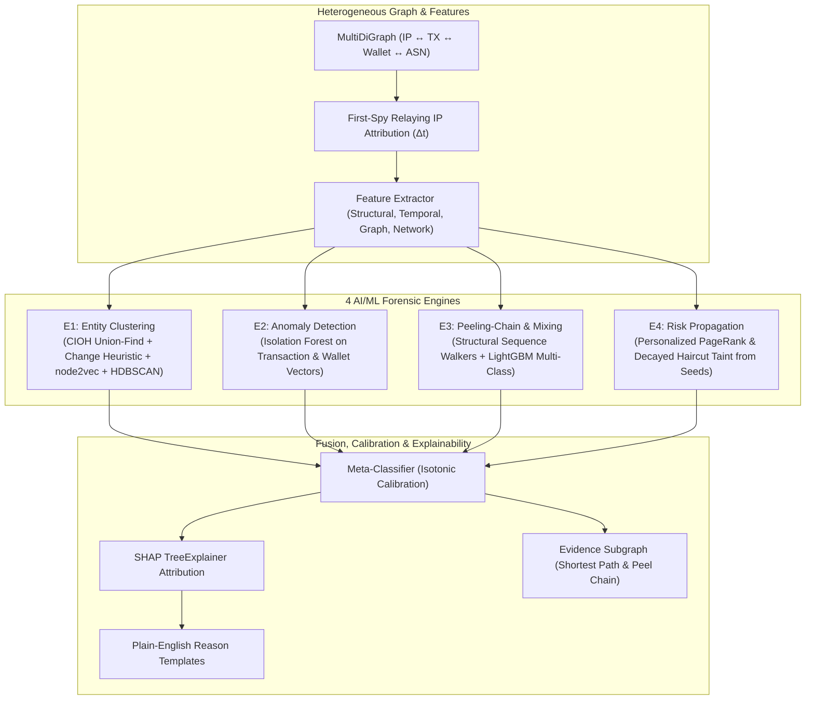

# BEANS — Master Roadmap & Solution Architecture
**SIH PS 26146 · AI-Powered Monitoring & Analysis of Bitcoin Transaction Traffic · NTRO**

> Single source of truth for the project. Covers requirements, architecture, feature priorities (MoSCoW), ML design, synthetic data generation, repository layout, build timeline, and demo script.

---

## 0. Executive Summary

**BEANS** is an offline, Linux-native forensic intelligence pipeline:

$$\text{CSV/JSON/XML} \longrightarrow \text{Ingest + Validate + GeoIP/ASN Enrich} \longrightarrow \text{Heterogeneous Graph (IP ↔ TX ↔ Wallet ↔ ASN)}$$
$$\longrightarrow \text{4 AI/ML Engines (E1: Clustering, E2: Anomaly, E3: Peel/Mix, E4: Risk Propagation)}$$
$$\longrightarrow \text{Calibrated Fusion Score + SHAP Explanations} \longrightarrow \text{Ranked Alert List + Interactive UI + PDF Case Report}$$

### 5 Core Pillars:
1. **ML Decides, Rules Produce Features:** The problem statement specifies a *"working model — not just rules"*. Structural signatures (CoinJoin shape, peel chains, geo-jumps) serve as input features to trained ML models.
2. **Built-in Ground-Truth Synthetic Generator (`beans synth`):** Generates realistic UTXO ledger datasets across CSV, JSON, and XML with labelled illicit typologies and seed subsets.
3. **100% Offline-Native Execution:** No live internet lookups required. Bundles offline GeoIP DBs, snapshot threat ASNs, model weights, and prebuilt frontend assets.
4. **Lightweight, High-Performance Stack:** DuckDB (embedded columnar) + in-process NetworkX/igraph graph engine + FastAPI + Vite React UI. No heavy database servers.
5. **Human-Explainable AI (XAI):** Every alert carries a calibrated confidence, plain-English reason sentences derived from SHAP feature impacts, and an exact evidence subgraph.

---

## 1. Problem Statement Requirements Matrix

| # | Requirement | Implementation Component | Verification & Demo Proof |
|---|---|---|---|
| **R1** | Ingest & parse bulk metadata in CSV/JSON/XML | `beans.ingest` (PyArrow CSV, ijson, lxml.iterparse) | Load identical dataset in CSV, JSON, XML; show matching row counts |
| **R2** | Canonical schema fields (timestamps, IPs, ports, TXID, in/out addrs & amts, fee, script type) | `beans.schema.CanonicalRecord` | Pydantic validation + quarantine error report |
| **R3** | Geo country & ASN from offline database | `beans.enrich.geoip` (DB-IP Lite `.mmdb` / maxminddb) | Display offline GeoIP & ASN enrichment coverage |
| **R4** | Heterogeneous entity/transaction graph linking IPs, wallets, TXs | `beans.graph` MultiDiGraph with First-Spy estimator | Interactive Cytoscape link analysis with hop expansion |
| **R5** | AI/ML detection with 4 working models | `beans.engines` ($E_1, E_2, E_3, E_4$) + fusion model | Evaluation metrics on held-out synthetic test split |
| **R6** | Ranked, explainable alert list with calibrated confidence | `beans.score.fuse` + `beans.explain.shap` | Ranked alert table with SHAP waterfall & "Why flagged" |
| **R7** | Dashboard / link-analysis visualization with evidence | React 18 + Vite + Tailwind + Cytoscape.js | Live investigative UI walkthrough |
| **R8** | Complete offline solution for Linux | Offline bundle & zero runtime network calls | Live demo executed with Wi-Fi / networking disabled |
| **R9** | Working code repository | `BEANS/` clean modular codebase | Source repository & test suite passing |
| **R10**| Technical write-up | `docs/TECHNICAL_WRITEUP.md` | Comprehensive methodology & evaluation report |

---

## 2. Official AI/ML 4-Engine Architecture



### Engine Details:
1. **E1 — Entity Clustering:** 
   - Applies Common Input Ownership Heuristic (CIOH) via Union-Find, safely bypassing CoinJoin transactions.
   - Computes `node2vec` / graph adjacency embeddings $\rightarrow$ HDBSCAN for soft clustering across clusters.
2. **E2 — Anomaly Detection:**
   - Unsupervised Isolation Forest on transaction dimensions (fee-rate, UTXO age, output count) and wallet dimensions (degree velocity, lifetime).
   - Generates normalized anomaly score $S_{\text{anomaly}} \in [0, 1]$.
3. **E3 — Peeling-Chain & Mixing Typology Classifier:**
   - Feature extraction: Peel chain length, peel ratio mean, hop interval, output entropy, equal denomination counts.
   - Multi-class LightGBM classifier: `{NORMAL, PEEL_CHAIN, COINJOIN, FAN_OUT, DARKNET, HACK_LAUNDERING}`.
4. **E4 — Risk Propagation from Seeds:**
   - Personalized PageRank (PPR) on value-weighted transaction graph with teleport restricted to illicit seed addresses.
   - Decayed haircut taint tracking exact fund flow percentage back to seed sources.

---

## 3. Repository Structure

```
BEANS/
├── MASTER_ROADMAP.md            ← Master architecture and roadmap
├── README.md                    ← Quickstart guide, architecture summary, screenshots
├── Makefile                     ← synth, ingest, train, serve, demo, test commands
├── pyproject.toml
├── beans/
│   ├── cli.py                   ← Typer CLI entrypoint
│   ├── config.py                ← App configuration & thresholds
│   ├── schema.py                ← Pydantic canonical record schemas
│   ├── ingest/                  ← CSV, JSON, XML streaming parsers & quarantine
│   │   ├── csv_parser.py
│   │   ├── json_parser.py
│   │   ├── xml_parser.py
│   │   ├── mapping.py
│   │   └── quarantine.py
│   ├── enrich/                  ← Offline GeoIP & ASN threat intelligence
│   │   ├── geoip.py
│   │   └── asn_classifier.py
│   ├── store/                   ← DuckDB embedded storage & DDL
│   │   ├── duck.py
│   │   └── ddl.sql
│   ├── graph/                   ← Heterogeneous graph & first-spy logic
│   │   ├── build.py
│   │   └── firstspy.py
│   ├── features/                ← Transaction, wallet & network feature extractors
│   │   ├── tx.py
│   │   ├── wallet.py
│   │   └── network.py
│   ├── engines/                 ← 4 AI/ML engines
│   │   ├── e1_cluster.py
│   │   ├── e2_anomaly.py
│   │   ├── e3_peelmix.py
│   │   └── e4_propagate.py
│   ├── score/                   ← Meta-fusion & isotonic calibration
│   │   ├── fuse.py
│   │   └── calibrate.py
│   ├── explain/                 ← SHAP explainability & reason templates
│   │   ├── shap_explain.py
│   │   ├── reasons.py
│   │   ├── templates.yaml
│   │   └── evidence.py
│   ├── report/                  ← Law Enforcement PDF & JSON report exporter
│   │   └── pdf_export.py
│   ├── synth/                   ← Stateful UTXO synthetic forensic generator
│   │   ├── ledger.py
│   │   ├── actors.py
│   │   ├── typologies.py
│   │   └── writer.py
│   └── api/                     ← FastAPI application & REST routers
│       ├── main.py
│       └── routes/
├── ui/                          ← React 18 + Vite + Tailwind + Cytoscape.js
│   ├── src/
│   │   ├── components/
│   │   │   ├── OverviewDashboard.jsx
│   │   │   ├── AlertTriage.jsx
│   │   │   ├── LinkGraph.jsx
│   │   │   ├── TimelineReplay.jsx
│   │   │   ├── GeoMap.jsx
│   │   │   ├── Entity360.jsx
│   │   │   ├── CaseManager.jsx
│   │   │   ├── ModelCard.jsx
│   │   │   └── IngestStudio.jsx
│   │   ├── App.jsx
│   │   └── main.jsx
├── models/                      ← Trained ML model weights (*.pkl) & model_card.json
├── data/
│   ├── geoip/                   ← DB-IP Lite .mmdb files
│   ├── intel/                   ← Offline snapshots of Tor exits, VPNs, bulletproof ASNs
│   ├── seeds/                   ← Known illicit seed wallets
│   └── synth/                   ← Generated demo datasets
├── tests/                       ← PyTest unit & end-to-end test suite
└── docs/
    ├── TECHNICAL_WRITEUP.md     ← Official NTRO technical write-up
    └── DATA_FORMATS.md          ← Specification of supported input layouts
```

---

## 4. Feature Prioritization (MoSCoW)

- **MUST (MVP):**
  - [x] Streaming ingestion for CSV, JSON (Array & NDJSON), and XML with quarantine routing.
  - [x] Canonical schema validation & array-field parsing.
  - [x] Offline GeoIP & ASN enrichment.
  - [x] Heterogeneous graph with first-spy IP attribution.
  - [x] E1 Clustering (CIOH + embeddings), E2 Anomaly (Isolation Forest), E3 Typology (LightGBM/RF), E4 Risk Propagation (PPR + Taint).
  - [x] Calibrated fusion scoring ($0-100$) + SHAP plain-English explanations.
  - [x] UI with Cytoscape.js link analysis, alert triage, and entity inspection.
  - [x] Synthetic generator with ground-truth labels in all 3 formats.
  - [x] 100% offline runnable demo.

- **SHOULD (Competitive Edge):**
  - [x] Step-by-step Timeline fund-flow replay with hop slider.
  - [x] Offline world GeoMap with impossible travel velocity arcs.
  - [x] Case management & LE Evidence Pack export (PDF + JSON with input file SHA-256).
  - [x] Analyst feedback loop (false-positive tagging $\rightarrow$ active learning).
  - [x] Model Card with confusion matrix, PR curves, and feature importances.
  - [x] Dynamic column mapping parser (`--mapping`).
  - [x] Seed management UI (upload seeds $\rightarrow$ instant re-propagation).
