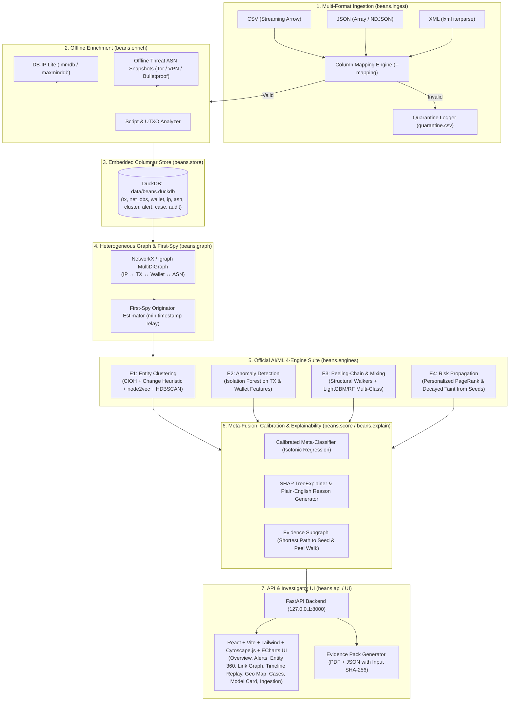

# BEANS — Master Roadmap & Implementation Plan
**SIH PS 26146 · AI-Powered Monitoring & Analysis of Bitcoin Transaction Traffic · NTRO**

> **Goal:** Build a production-grade, 100% offline, Linux-native forensic intelligence pipeline that ingests multi-format Bitcoin P2P telemetry (CSV/JSON/XML), enriches with offline GeoIP/ASN data, constructs a heterogeneous correlation graph (IP ↔ TX ↔ Wallet ↔ ASN) with "first-spy" IP attribution, executes 4 distinct AI/ML engines (Entity Clustering, Anomaly Detection, Peeling-Chain/Mixing Classification, and Personalized PageRank Risk Propagation), fuses predictions with isotonic calibration and SHAP explainability, and serves an interactive investigative UI (Cytoscape.js, timeline replay, geo-map, model card, and court-admissible PDF case reports).

---

## 1. System Architecture Overview

---

## 2. Execution Tasks & Milestones

### Phase 1: Canonical Schema, Streaming Parsers & Ingestion Engine
- **Task 1.1**: Define Canonical Schema in `beans/schema.py` (Pydantic v2 validation for `timestamp`, `src/dst IP & port`, `txid`, `input_addresses[]`, `input_amounts[]`, `output_addresses[]`, `output_amounts[]`, `fee`, `script_type`).
- **Task 1.2**: Implement Streaming Multi-Format Parsers in `beans/ingest/`:
  - `csv_parser.py`: PyArrow / standard streaming CSV with array delimiter support (`;` or JSON).
  - `json_parser.py`: ijson streaming parser supporting JSON arrays and NDJSON.
  - `xml_parser.py`: `lxml.etree.iterparse` memory-efficient XML parser.
  - `mapping.py`: Flexible column remapping parser supporting custom YAML schemas.
  - `quarantine.py`: Auto-routing of corrupt/invalid rows to `quarantine.csv` with precise error messages.
- **Task 1.3**: Implement Offline Enrichment in `beans/enrich/`:
  - `geoip.py`: DB-IP Lite / MaxMind `.mmdb` reader with local fallback IP database.
  - `asn_classifier.py`: Offline classification of ASNs into `RESIDENTIAL`, `DATACENTER`, `VPN`, `TOR_EXIT`, and `BULLETPROOF`.
- **Task 1.4**: Setup DuckDB Embedded Storage in `beans/store/`:
  - Table schemas for `tx`, `tx_input`, `tx_output`, `net_obs`, `wallet`, `ip`, `asn`, `cluster`, `alert`, `case_file`, `audit_log`, `feedback`.

---

### Phase 2: Synthetic Forensic Generator (`beans synth`)
- **Task 2.1**: Implement UTXO Ledger Simulation in `beans/synth/ledger.py` maintaining stateful UTXOs, script types (`P2PKH`, `P2SH`, `P2WPKH`, `P2WSH`, `P2TR`), fee-rates, and realistic address formats.
- **Task 2.2**: Implement Legitimate Actor Behaviors in `beans/synth/actors.py` (Retail users, Exchange hot-wallet batches, Merchant sweeps, Miner coinbases).
- **Task 2.3**: Implement 8 Illicit Typologies in `beans/synth/typologies.py`:
  1. `RANSOMWARE`: Large inflow $\rightarrow$ hold $\rightarrow$ fan-out split $\rightarrow$ CoinJoin mixer $\rightarrow$ cash-out via bulletproof ASN.
  2. `PEEL_CHAIN`: Multi-hop sequence ($N=5-50$) peeling small amounts while rapidly re-spending change.
  3. `COINJOIN`: High multi-party inputs with $\ge 5$ uniform denomination outputs.
  4. `DARKNET_MARKET`: Multisig custody with cyclic 24-hour settlement payouts.
  5. `HACK_LAUNDERING`: Sudden massive drain $\rightarrow$ high velocity $\rightarrow$ geo-hopping VPN broadcasts.
  6. `FAN_OUT_SMURF`: Structuring into sub-threshold amounts across disparate IPs on one ASN.
  7. `ROUND_TRIP`: Circular fund flow $A \rightarrow B \rightarrow C \rightarrow A$.
  8. `DUSTING`: Tiny outputs blasted to dozens of addresses.
- **Task 2.4**: Multi-Format Writer & Presets in `beans/synth/writer.py`:
  - Exports `transactions.csv`, `transactions.json`, `transactions.xml`, `labels.csv`, `seeds.csv`, and `manifest.json`.
  - Presets: `tiny` (5k rows for unit tests), `demo` (50k-200k rows for live demo), `bench` (1M+ rows for performance benchmarking).

---

### Phase 3: Heterogeneous Graph Engine & First-Spy Attribution
- **Task 3.1**: Build Heterogeneous MultiDiGraph in `beans/graph/build.py`:
  - Nodes: `Wallet`, `Transaction`, `IP`, `ASN`, `Cluster`.
  - Edges: `IN_SPEND`, `OUT_PAYMENT`, `RELAYED`, `IN_ASN`, `OWNS`.
- **Task 3.2**: Implement First-Spy Network Attribution in `beans/graph/firstspy.py`:
  - Identifies earliest relaying IP timestamp $\min(t_{\text{relay}})$ per TXID.
  - Computes first-spy confidence score based on relay propagation delta ($\Delta t = t_2 - t_1$).
- **Task 3.3**: Extract Graph Structural Features in `beans/features/`:
  - Transaction-level features (entropy, fan-out ratio, fee-rate, UTXO age).
  - Wallet-level features (in/out degree, holding velocity, counterparty diversity, volume).
  - Network-level features (distinct IPs/ASNs, geo-velocity impossible travel speed in km/h, non-standard port ratios).

---

### Phase 4: The 4 AI/ML Forensic Engines
- **Task 4.1: Engine 1 (Entity Clustering)**:
  - `beans/engines/e1_cluster.py`: CIOH Disjoint-Set Union-Find (excluding detected CoinJoin transactions) + change-address heuristic.
  - Graph embeddings via `node2vec` / adjacency random walks $\rightarrow$ HDBSCAN / Agglomerative clustering for cross-cluster soft merges.
- **Task 4.2: Engine 2 (Anomaly Detection)**:
  - `beans/engines/e2_anomaly.py`: Isolation Forest trained on transaction and wallet behavioral feature vectors.
  - Normalizes anomaly percentile score ($S_{\text{anomaly}} \in [0, 1]$).
- **Task 4.3: Engine 3 (Peeling-Chain & Mixing Typology Classifier)**:
  - `beans/engines/e3_peelmix.py`: Structural walk feature extractors (peel chain length, ratio mean, hop interval, output entropy, equal denomination counts).
  - LightGBM / Random Forest multi-class model `{NORMAL, PEEL_CHAIN, COINJOIN, FAN_OUT, DARKNET, HACK_LAUNDERING}` with class-weight rebalancing.
- **Task 4.4: Engine 4 (Risk Propagation from Seeds)**:
  - `beans/engines/e4_propagate.py`: Personalized PageRank (PPR) on value-weighted transaction graph with teleport set to known seed wallets.
  - Decayed "haircut" proportional taint model tracing exact fund flow percentage back to illicit sources.

---

### Phase 5: Calibrated Fusion, SHAP Explainability & Evidence Subgraphs
- **Task 5.1**: Meta-Fusion & Isotonic Calibration in `beans/score/fuse.py` and `beans/score/calibrate.py`:
  - Fuses $E_1, E_2, E_3, E_4$, and network correlation features into a calibrated probability $P(\text{illicit})$.
  - Converts probability to risk score $0-100$ and calculates confidence rating ($0.0-1.0$).
- **Task 5.2**: Explainability Engine in `beans/explain/`:
  - `shap_explain.py`: SHAP TreeExplainer feature attribution for top contributing positive and negative indicators.
  - `reasons.py`: Plain-English narrative reason generator using forensic templates.
  - `evidence.py`: Extracts exact shortest value-weighted path to seed, ordered peel chain hops, and Cytoscape evidence subgraph.

---

### Phase 6: FastAPI REST Backend & Case Management
- **Task 6.1**: Backend routes in `beans/api/routes/`:
  - `/api/ingest`: Streaming file upload (CSV/JSON/XML) with real-time progress and column mapping.
  - `/api/pipeline/run`: Triggers the complete correlation, ML inference, and scoring cycle.
  - `/api/alerts`: Ranked alerts with severity, plain-English reasons, SHAP impacts, and evidence.
  - `/api/entity/{type}/{id}`: 360° profile for Wallets, IPs, Clusters, and TXIDs.
  - `/api/graph/subgraph`: Center-node $k$-hop subgraph extractor with edge filtering.
  - `/api/seeds`: Seed wallet upload with live re-propagation.
  - `/api/cases`: Case file grouping, notes, audit log, and feedback loop (false positive tagging).
  - `/api/model/card`: Performance metrics, confusion matrix, and feature importances.
  - `/api/cases/{id}/export`: Generates complete evidence package with SHA-256 verification hash and PDF export.

---

### Phase 7: Interactive Investigator UI (React + Tailwind + Cytoscape + ECharts)
- **Task 7.1**: Build Modern UI Components in `ui/src/`:
  - **Overview Dashboard**: KPIs, severity distribution, threat classification chart, recent alert feed.
  - **Ranked Alert Triage**: Filterable by severity, typology, status; one-click investigation modal with SHAP waterfall and reasons.
  - **Link Analysis Graph**: Cytoscape.js canvas with Cose/Dagre layouts, node colors by threat type, red rings on seeds, peel path highlighting, and hop expander.
  - **Timeline Fund Flow**: Interactive step-by-step transaction flow with hop replay slider.
  - **Offline Geo Map**: World map showing IP broadcast locations, ASN types, and impossible travel arcs.
  - **Entity 360 Inspector**: Balance, transaction history, counterparty table, radar score breakdown.
  - **Case Management & PDF Dossier**: Case files, status transitions, and one-click evidence pack download.
  - **Model Card & Metrics**: PR curves, confusion matrix, calibration plot, feature importance.
  - **Ingestion & Simulation Studio**: Multi-format file uploader, column mapping dropdowns, quarantine log viewer, and 1-click synthetic generator controls.

---

### Phase 8: Offline Packaging, Testing & Verification
- **Task 8.1**: Comprehensive PyTest suite in `tests/` verifying multi-format ingestion, all 4 ML engines, fusion calibration, and evidence generation.
- **Task 8.2**: Create `Makefile` and CLI typer entrypoints (`beans ingest`, `beans synth`, `beans train`, `beans serve`, `beans demo`).
- **Task 8.3**: Verify 100% offline execution with networking disabled.
