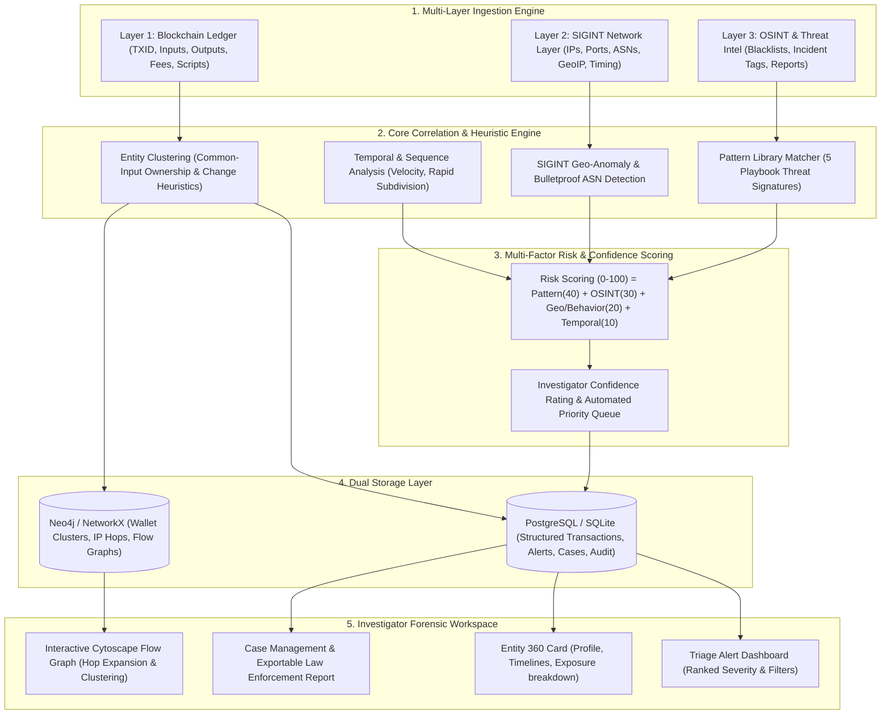

# Blockchain Forensics Intelligence Framework (BEANS) - Prototype Implementation Plan

> **Goal:** Build an end-to-end working prototype for the Blockchain Forensics Intelligence Framework that ingests Bitcoin transaction logs and network metadata, executes automated multi-factor correlation and threat pattern matching (Ransomware, CoinJoin Mixing, Exchange Hack Laundering, Darknet, Exchange Consolidation), calculates risk scores, and provides an interactive Investigator Dashboard with graph exploration and LE-ready evidence reports.

**Architecture:** A dual-storage architecture combining PostgreSQL/SQLite (for structured ledger entries, network observations, threat intel feeds, case files, and audit logs) and NetworkX/Neo4j (for multi-hop transaction tracing and entity co-occurrence graph clustering), connected to a Python (FastAPI/Flask) analytics and correlation engine, served to a responsive modern React/Tailwind investigation UI with Cytoscape/Recharts graph and timeline visualizations.

**Tech Stack:**
- **Backend:** Python 3.10+, FastAPI/Flask, SQLAlchemy, NetworkX, GeoIP2/MaxMind DB, Scikit-learn/Pandas, Pydantic
- **Databases:** PostgreSQL (with SQLite fallback for zero-dependency standalone prototype testing), Neo4j / NetworkX graph engine
- **Frontend:** React 18, Tailwind CSS, Lucide Icons, Cytoscape.js (for network graph analysis), Recharts (for timeline & volume distributions)
- **Synthetic Data & Forensics Generators:** Configurable forensic dataset generator simulating LockBit ransomware, CoinJoin mixing syndicates, exchange sweep operations, and VPN/bulletproof hoster network hops.

---

## Technical Approach & Architecture Breakdown

---

## Detailed Investigative Methodology

### 1. Multi-Layer Correlation Logic
1. **Common Input Ownership Heuristic (CIOH):** All input addresses co-spent in a single Bitcoin transaction are flagged as belonging to the same entity cluster unless a CoinJoin signature is detected.
2. **SIGINT Network Mapping:** Every transaction broadcast is correlated with network observations within a $\Delta t \le 120s$ window to map wallet addresses to originating IP addresses, ASNs, and countries.
3. **Geo-velocity Anomaly:** Highlights impossible travel time (e.g., broadcast from ASN 12345 in NL, followed 30 minutes later by an input spend broadcast from HK without residential ISP traits).
4. **Threat Playbook Matching:**
   - **Ransomware Collection (e.g. LockBit):** New wallet (<24h), high incoming value, rapid fan-out subdivision (1 to $N$ addresses in $<2$ hours), immediate mixing participation, and bulletproof hosting ASN broadcast.
   - **CoinJoin / Mixing:** Transactions with $M \ge 5$ equal denomination outputs and diverse inputs, zero address reuse.
   - **Exchange Hack Laundering:** High-velocity chain-hopping, rapid hops through peel chains, high transaction fees to prioritize block inclusion.
   - **Exchange Sweeps:** Many-to-few batching at regular intervals, low risk score.

---

## Implementation Tasks

### Task 1: Core Backend Architecture & Database Models
- **Files:** `backend/app/models/schema.py`, `backend/app/core/config.py`, `backend/app/db/database.py`
- **Actions:** Define SQLAlchemy ORM schema supporting PostgreSQL and SQLite for Transactions, NetworkObservations, ThreatIntel, WalletProfiles, Alerts, CaseFiles, and AuditLogs.

### Task 2: Forensic Dataset & Playbook Scenario Generator
- **Files:** `backend/app/services/synthetic_generator.py`, `data/seeds/forensics_scenarios.json`
- **Actions:** Build a forensic data generator capable of seeding realistic multi-hop Bitcoin transactions interwoven with network SIGINT (Dutch bulletproof IPs, Tor exit nodes, residential ISPs) and OSINT threat intel (LockBit 2024 campaign, Darknet marketplace busts).

### Task 3: Ingestion & Normalization Pipeline
- **Files:** `backend/app/services/ingestion.py`, `backend/app/routes/data_routes.py`
- **Actions:** Create fast batch-ingestion endpoints for transactions, network traffic captures (PCAP/NetFlow JSON), and threat intel feeds with validation and automatic profile indexing.

### Task 4: Graph Engine & Entity Clustering Service
- **Files:** `backend/app/services/graph_service.py`, `backend/app/services/clustering.py`
- **Actions:** Implement NetworkX/Neo4j graph representation of wallet clusters, transaction flow edges, and IP associations with multi-hop neighbor search and path tracing.

### Task 5: Correlation, Anomaly & Heuristic Detection Engine
- **Files:** `backend/app/services/correlation_engine.py`, `backend/app/services/pattern_matcher.py`
- **Actions:** Implement the 5 threat playbook signatures, SIGINT geo-anomaly detection, temporal velocity metrics, and automated alert triggering.

### Task 6: Risk Scoring & Confidence Matrix
- **Files:** `backend/app/services/scoring_service.py`
- **Actions:** Build the weighted composite scoring engine: $Risk = Pattern(40) + OSINT(30) + Geo(20) + Temporal(10)$, generating human-explainable evidence breakdowns.

### Task 7: REST API Endpoints & Case Management
- **Files:** `backend/app/routes/api_routes.py`, `backend/app/routes/case_routes.py`, `backend/app/main.py`
- **Actions:** Expose endpoints for `/api/alerts`, `/api/entities/{id}`, `/api/graph/{id}`, `/api/cases`, and `/api/export-dossier/{case_id}` (Markdown & JSON handoff).

### Task 8: Interactive Investigator Frontend (React + Cytoscape + Tailwind)
- **Files:** `frontend/src/components/Dashboard.jsx`, `frontend/src/components/GraphExplorer.jsx`, `frontend/src/components/EntityDetail.jsx`, `frontend/src/components/CaseManager.jsx`, `frontend/src/components/DossierExport.jsx`
- **Actions:** Build a responsive, dark/cyber-forensics-themed UI featuring real-time alert triage, interactive Cytoscape graph inspection with node clustering, timeline transaction flows, and one-click Law Enforcement evidence dossier export.

### Task 9: Verification & End-to-End Forensic Testing
- **Files:** `backend/tests/test_correlation.py`, `backend/tests/test_scoring.py`, `backend/tests/test_dossier.py`
- **Actions:** Verify that seeded ransomware, mixing, and hack scenarios are accurately detected, scored with $\ge 85$ risk score, and export complete audit trails.
